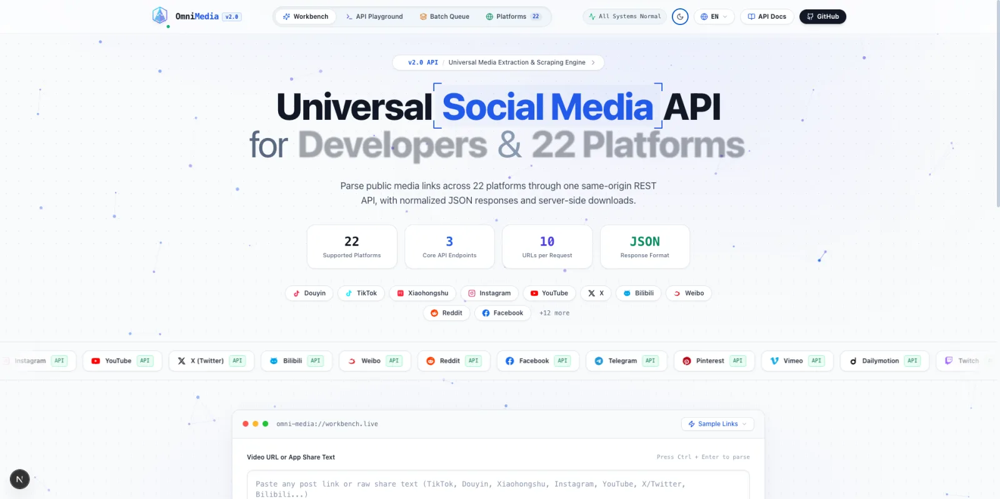
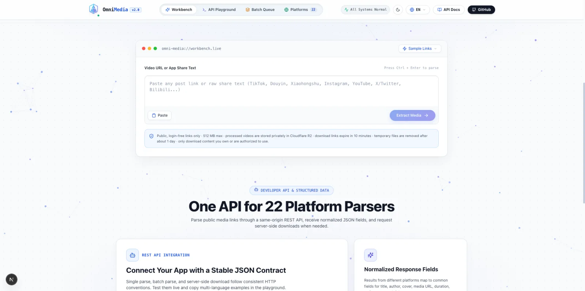
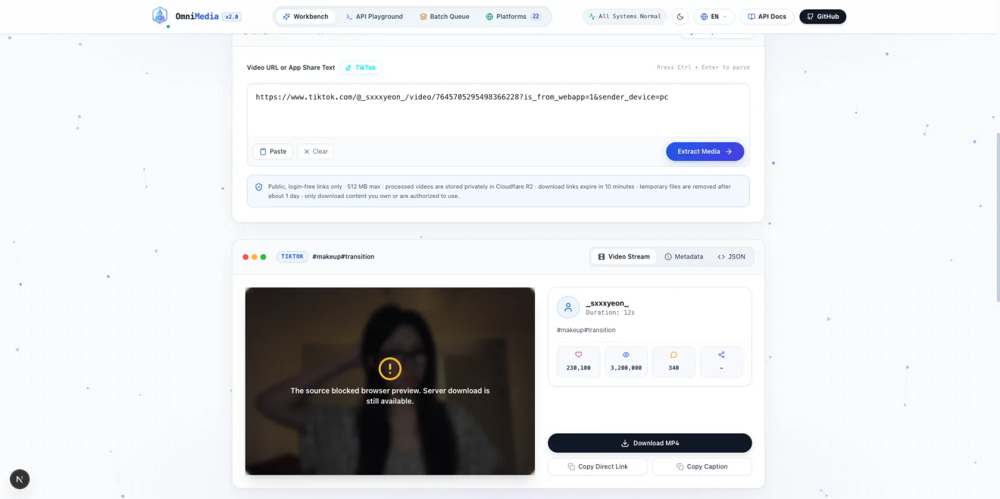

<div align="center">
  <a href="https://useomnimedia.com/">
    
  </a>

  <h1>OmniMedia</h1>

  <p><strong>在一个地方解析、预览并下载 22 个社交平台的公开媒体。</strong></p>

  <p>
    粘贴链接或 App 中复制的完整分享文本，即可查看统一格式的媒体信息、
    批量处理链接，并通过简洁的双语界面下载支持的视频。
  </p>

  <p>
    <a href="https://useomnimedia.com/"><strong>在线体验</strong></a>
    ·
    <a href="#快速开始">快速开始</a>
    ·
    <a href="#api-示例">API 示例</a>
    ·
    <a href="README.md">English</a>
  </p>

  <p>
    
    
    
    <a href="LICENSE"></a>
  </p>
</div>

## 产品演示

<div align="center">
  <a href="./.github/assets/omnimedia-demo.mp4">
    
  </a>
  <p><a href="./.github/assets/omnimedia-demo.mp4"><strong>观看 12 秒产品演示 →</strong></a></p>
</div>

<table>
  <tr>
    <td width="50%"></td>
    <td width="50%"></td>
  </tr>
  <tr>
    <td align="center">统一解析工作台</td>
    <td align="center">媒体预览与标准化信息</td>
  </tr>
</table>

## 可以做什么

- 粘贴公开帖子链接，或直接粘贴从 App 复制的完整分享文本。
- 将不同平台的媒体信息解析成统一、易用的结果。
- 切换到个人主页模式，浏览公开作品和创作者信息。
- 在浏览器中直接预览可播放的视频和封面。
- 在批量中心一次加入最多 40 个链接，并保持结果顺序。
- 通过服务端下载支持的媒体，减少源站临时链接失效带来的影响。
- 使用 Chrome/Edge 扩展，从工具栏解析当前页面或粘贴的链接。
- 支持简体中文与英文、浅色与深色主题，并适配桌面和移动设备。

## 支持平台

| | | | |
| --- | --- | --- | --- |
| TikTok | 抖音 | Instagram | Telegram |
| YouTube | Twitter / X | Facebook | Bilibili |
| 微博 | Reddit | Vimeo | Dailymotion |
| Twitch | Pinterest | Tumblr | Rumble |
| 小红书 | AcFun | 优酷 | 爱奇艺 |
| 腾讯视频 | 西瓜视频 | | |

OmniMedia 面向公开且无需登录的媒体。付费、私密、需要登录、地区限制、
已删除或受 DRM 保护的内容可能无法使用，本项目也不会尝试绕过这些限制。
平台规则和页面结构随时可能发生变化。Telegram 公开网页有时不会
提供较大媒体的下载地址；遇到这种情况时，请改用 Telegram 打开该帖子。

## 立即体验

打开[在线体验站](https://useomnimedia.com/)，将支持的
链接或分享文本粘贴到解析工作台即可。

### 抖音分享文本

```text
7.43 pda:/ 从抖音复制的完整文案... https://v.douyin.com/xxxxx/ 复制此链接...
```

### 普通链接和短链接

```text
https://www.tiktok.com/@creator/video/1234567890
https://www.youtube.com/watch?v=xxxxxxxxxxx
https://www.instagram.com/reel/xxxxxxxxxxx/
https://www.bilibili.com/video/BVxxxxxxxxxx
```

### 批量输入

在批量中心每行粘贴一个链接。Web 界面一次最多接收 40 个链接，并以有界
批次依次处理。

### 创作者主页

将工作台切换到**个人主页**，然后粘贴支持的公开主页链接。OmniMedia
会展示可获取的头像、简介、认证状态、公开数据和分页作品列表。每次请求
最多返回 12 个公开作品；不支持私密或必须登录的主页。

### 浏览器扩展

项目内置的 Chrome/Edge Manifest V3 扩展可解析粘贴的公开链接或当前
标签页 URL，并将下载操作交给完整的 OmniMedia 工作台。它不会读取页面内容、
浏览历史、Cookie、凭证、私人消息或剪贴板数据。本地安装和打包方法请查看
[browser-extension/README.md](browser-extension/README.md)。

## 快速开始

### Docker

使用 Docker 可以最简单地运行完整 Web 应用：

```bash
git clone https://github.com/xubaoer19940428-creator/omni-media.git
cd omni-media
docker build -t omnimedia .
docker run --rm -p 7860:7860 omnimedia
```

浏览器打开 <http://localhost:7860>。

### 从源码运行

需要准备 Python 3.10+、Node.js 22+、pnpm 和 ffmpeg。

```bash
git clone https://github.com/xubaoer19940428-creator/omni-media.git
cd omni-media

corepack enable
cd frontend && pnpm install && pnpm run build && cd ..

python3 -m venv venv
source venv/bin/activate
pip install -r requirements.txt
python app.py
```

浏览器打开 <http://localhost:7860>。Windows 用户可使用
`venv\Scripts\activate` 激活虚拟环境。

可选配置请查看 [`.env.example`](.env.example)。

## API 示例

Web 界面使用相同的 API。下面的示例假设本地服务运行在
`http://localhost:7860`。请将示例 URL 替换为自己拥有或已获授权使用的
公开链接。

### 解析单个链接

```bash
curl -X POST http://localhost:7860/api/parse \
  -H "Content-Type: application/json" \
  -d '{"url":"https://www.youtube.com/watch?v=xxxxxxxxxxx"}'
```

### 批量解析

API 每次请求最多接收 10 个链接。

```bash
curl -X POST http://localhost:7860/api/batch-parse \
  -H "Content-Type: application/json" \
  -d '{"urls":["https://v.douyin.com/xxxxx/","https://www.tiktok.com/@creator/video/1234567890"]}'
```

### 解析创作者主页

主页接口每次最多返回 12 个公开作品。当 `has_more` 为 true 时，将返回的
`next_cursor` 作为 `cursor` 传入，即可加载下一页。

```bash
curl -X POST http://localhost:7860/api/profile/parse \
  -H "Content-Type: application/json" \
  -d '{"url":"https://www.tiktok.com/@creator","limit":12,"cursor":0}'
```

### 下载支持的媒体

使用解析流程返回的原始公开链接：

```bash
curl -X POST http://localhost:7860/api/download \
  -H "Content-Type: application/json" \
  -d '{"original_url":"https://www.youtube.com/watch?v=xxxxxxxxxxx"}'
```

响应中会包含 `download_url`。根据部署方式，它可能是应用内的相对地址，
也可能是短期有效的完整地址。

其他常用接口：

- `GET /api/health` — 服务健康状态
- `GET /api/platforms` — 支持平台列表
- `GET /api/proxy-image?url=...` — 有大小限制的封面图片代理

## 合理使用

请仅下载自己拥有或已获得授权的内容。使用者有责任遵守平台条款、版权规则、
隐私法律和当地法规。本项目用于合法的互操作、个人工具、研究与开发，不代表
使用者自动获得复制或再次分发第三方内容的权利。

生产网站仅记录不包含查询参数的汇总页面访问数据，用于改进可靠性和产品体验。只有
`useomnimedia.com` 会启用统计；浏览器扩展不包含统计或跨站跟踪。

## 参与贡献

欢迎提交 Issue 和 Pull Request。平台经常更新，一个有效的错误报告最好包含
平台名称、可公开访问的示例链接、错误信息和发生时间。请勿提交 Cookie、凭证、
签名下载地址或其他秘密信息。

## 许可证

OmniMedia 使用 [MIT License](LICENSE) 发布。第三方组件及其声明请查看
[THIRD_PARTY_NOTICES.md](THIRD_PARTY_NOTICES.md)。
